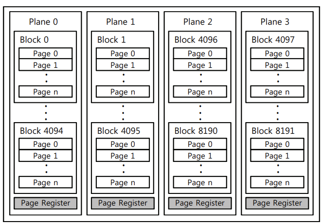
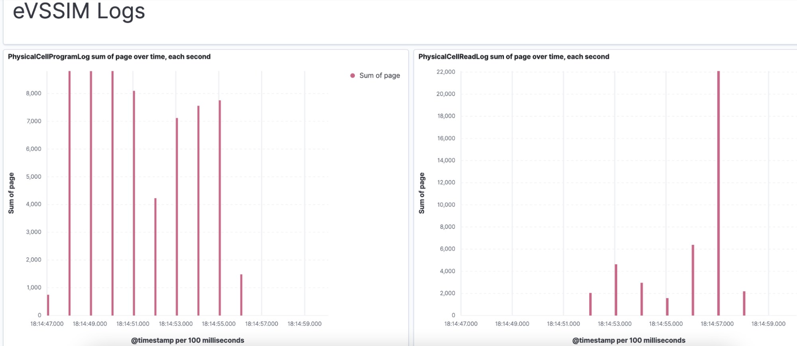
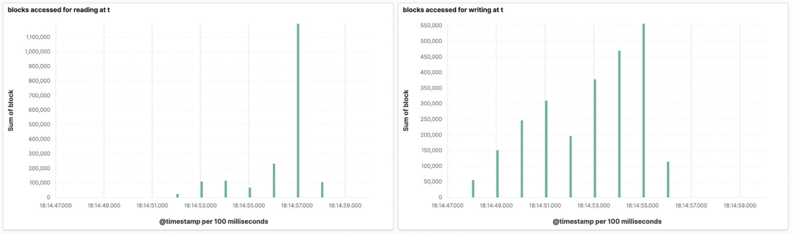
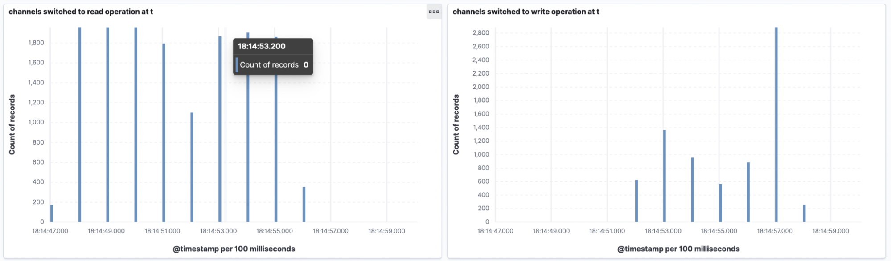
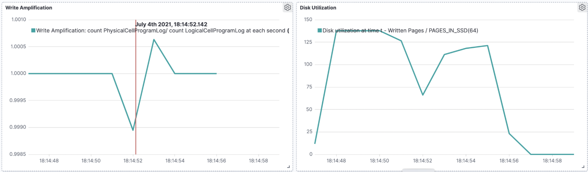
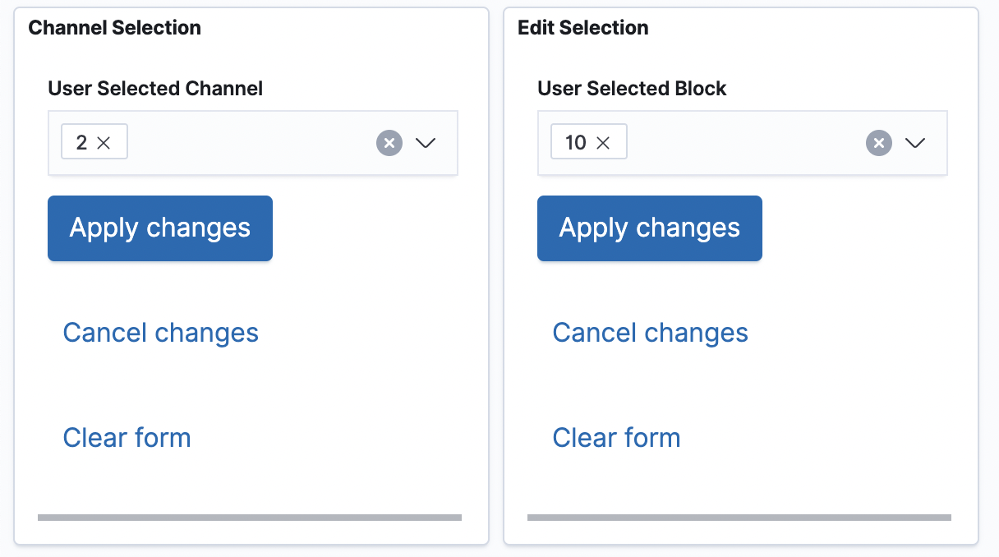
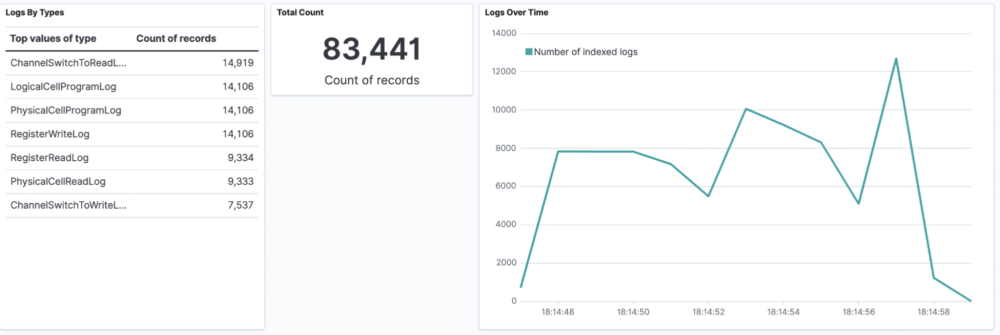

# Final project in OS Workshop, adding ELK Logging and Testing to eVSSIM 

# Overview

**eVSSIM Simulator** simulates software-based SSD. One of it's purposes is it to research SSD behavior under different use-cases. To enable this research we want to be able to observe it's inner action, we need to log it's actions. 
Currently eVSSIM contains Real Time analyzer which is able to show a fixed current status of the simulator from various perspectives. The next level of visibilty into the simulator operation is aggrigating the logs and conveniently compose dashboards for asking questions about the specific operations. Another important goal is to save data over time in order to be able to do time-series analysis. 

The implementation of the project is writing logs in JSON format, describing main actions in the simulator, index them to Elastic Search and visualize the logs with Kibana. This will allow us to ask questions about specific actions and over-time behavior and observe basic dashboards that we will provide. 

## Project components:
* In-line simulator code that write logs in JSON format of each actions. Log types are defined [here](https://github.com/davidsaOpenu/simulator/blob/master/eVSSIM/LOG_MGR/logging_parser.h). 
*  Index logs to ELK using Filebeat
*  Built-in dashboards
*  Standalone log generator for testing
*  Testing framework to validate dashboard computations, for example: aggrigations over time

## Writing Logs to file
TODO

## Log Types:
1. **PhysicalCellReadLog** - Physical read of cell. Parameters are channel, block, page(ammount of pages read) and the time. 
2. **PhysicalCellProgramLog** - Physical write of cell. Parameters are channel, block, page(ammount of pages writing) and the time. 
3. **LogicalCellProgramLog** - Logical log, which sums all actions need to be done for writing(switching channel , actual write). This log is probably unnecessary and would be probably deprecated. Currently used for calulating Write Amplification which represents the ratio between logical and physical writes. When the SSD is more efficient this ration would be smaller and there would be less physical writes for each logical write. Parameters are the same as former logs. 
4. **RegisterReadLog** - Change register to read mode. Parameters are channel, die(the flash we are writing), reg(index of the register) and the time. 
5. **RegisterWriteLog** - Change register to read mode, same paramters as former log. 
6. **BlockEraseLog** - Erasing block from disk, same parameters as former log. 
7. **ChannelSwitchToReadLog** - Change channel state to read, parameters are channel index and time. 
8. **ChannelSwitchToWriteLog** - Change channel state to write, parameters are the as former log. 

### Disk structure 
flash is a die, each flash(or plane) contains channels. each channel contains blocks and pages. each regiser and channel can be in read or write mode. 

as can be seen in the following diagaram: 

[Reference](https://www.researchgate.net/publication/261391212_VSSIM_Virtual_machine_based_SSD_simulator)

In all of the logs we are using time in resolution of milliseconds. 

Every action causes configurable delay to the simulator in order to be realstic, example configation is [here, lines 98-193](https://github.com/davidsaOpenu/simulator/blob/master/eVSSIM/tests/host/base_emulator_tests.h)

## ELK Stack
That's what we are here for!

### Installation
First things first, small technical intro of our usage of the The ELK stack. It conssists of 4 main projects: 

1. **ElasticSearch** - Text DB, enables text and structred search. Uses different indexes for storing data. 
2. **Kibana** - Visualization framework, enables to easily build dashboards to visualize our data 
3. **Logstash** - internal framework for indexing logs to ElasticSearch. 
4. **Filebeat** - Monitor directory for log files and upload logs to ElasticSearch. 

We will install everything possible as docker, for ELK we'll use (this project)[https://github.com/deviantony/docker-elk], we won't change anything in the configuration except Memory allocated for the dockers(512mb instead of 256mb). 

Kibana configuration would be exported JSON file which contains the dashboards, which were built using Kibanas' web interface. 

I had many problems with the configurations of the dockers, if something needs to be changed, do it carefully. Mostly on network related configurations, because all the dockers need to connect each other. 

In the dockers we are using the Volume feature, which gives as the option to map host directory to fixed location in the container, so the project could run from every directory on the host. 

One thing to note in Filebeat configurations is the time field. We want ElasticSeach index our logging_time field as a native time. All of the aggrigations and searches are time based and it's critical for it be indexed as native time. Also put attention to the TimeZone, i've used Israels' TZ, change it if needed. 

### Dashboards
Those are the dashboards we currently built with Kibana. To see it live, please browse to [http://localhost:5601](http://localhost:5601).
Adding or changing dashboards is very easy, Kiaban is well documented and there are plennty of features. The dashboards were built as standard dashbords, mostly using built-in aggregations features and Lens dashboards, which are more compatible to visualize data over time.

The dashboards themselves are self-expleneatory, the example data was generated from the simulator with some simple read and write traffic. 










The user can filter specific channels and blocks in this panel: 



In order to monitor this system, there is a monitoring dashboard that shows how many logs were indexed over time, and the amount of logs in total and from each type, in the selected time: 



## Testing Framework

So after indexing and visualsing all this data, we need to verify all of the computations the Kibana made for us are correct. So probably not many from the ELK developers inteded that someone will **actually** verify the dashboards correctness, and theres' no simple API to download dashboard data. 
So we've developed a framework to do that. 

I've reached to elastic developers and they said the the process of exporting data from dashboard is fully client-side, so it's not that simple to develop API for that task. But still theres' Feature request for that from 2016, so it will defeintly come up in the following versions of Kibana. Until then, you can use this framework :)

### General purposes 
In order to verify the aggrigation we will need to calculate in seperatly from Kibana, on the original log file, and compare the results. This calculation would be made with Pandas python module. 

Pandas is pretty good with tabular data and would make the aggrigations for us. 

To get the results from kibana we will scrape it using Selenium(Framework for browser automation and user simulation, mostly used for automated Web testing).

We will use docker of selenium and Firefox browser, reasons are detailed in the technical issues section. 

We will use selenium for scraping Kibana web page.
 
Disadvantge of that is the we are using hard-coded HTML tags, which can **vary between versions and are not supposed to be compatible.** 

Our main testing script will run in a docker names `automated_testing`.

This scraping can made only to standard Kibana dashboard, that have "Export Dashboard as CSV" option, not for Lens dashboards. There we will need to do a different solution. 

I've checked the last 3 major versions of Kibana and they didn't changed. 

**So our testing process would be**:

```wrap
	1. Installing ELK Stack and filebeat.
	   Using the custom configuraion for each project. 
	   We will wait Kibana will finish it's setup.
	2. Index the log to ElasticSearch using Filebeat. 
		Wait until the log file is indexed. 
		By comparing number of logs in Kibana from this file, by it's name, 
		to number of lines in the files.  
	2. Computing the same aggrigations on the original log file with Pandas. 
	3. Execute our tests in a sepearte docker
	4. Compare the resulsts and exit the script if one of them isn't equal
	   (using python assert). 
```


Prior assumptions hard-coded in the code: 
1. Dashboard names inside kibana and all of the parametrs names and time interval(currently 100ms)
2. Time format of the log `2021-07-04T15:14:47.000Z`
2. Kibana is running at localhost:5601
3. Log names(in the Type field)
4. URL of the dashboard(times can be changed)

The tests were implemented for the first 3 dashboards: Block Writes, Page Reads, and Page Writes.


## Techinal issues encoutnred in developing the Testing framework:

* Files download automation - First i've tried to used chrome browser with remote selenium driver. Chrome browser has securtiy features that blocks downloading files by automation frameworks, as kibana. There were some configuration that were supposed to disable this feature, but it's not officialy documented. Finally it ended switching to Firefox.

* Files download permissions - The browser needs to have permissions to save files in the download directory. From stragne reasons, firefox didn't had permissions to save files in the default download directory. Using some bruteforce, i've found it had permissions to save files to the default user directory. Because it's a docker of selenium, the user is `seluser`. But, the browser was able to download there files, just went it wasn't mounted to the host as a volume, so i've needed to find a way to copy the files to the host in order to pass them to the other docker.  

* Copying files between dockers - because i wasn't able to use volumes, as described in the former issue, the solution was to use docker `cp` command to copy the files. If a docker container runs with `docker run  --privileged --pid=host` arguments, it will have permissions to run shell comands on the host running the container. 
	Inside the container we will use:
 `nsenter -t 1 -m -u -n -i sh -c "docker cp " + Selenium_container_id + ":/home/seluser " + Host_CSV_Exports_Directory "`. 
	We will find `Selenium_container_id ` in the same method, parsing `docker ps` output and looking for Selenium-firefox container. 
